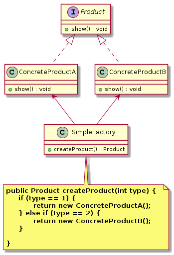

简单工厂模式（`Simple Factory Pattern`）
====================
### **意图**
> 定义一个工厂类来负责创建出不同产品类的实例。 

### **动机**
 当代码使用大量的具体类时，一旦加入新的具体类，就必须修改代码。我们可以用简单工厂将实例化具体类的代码（会变化的方面）从应用中抽离或封装起来。

 由工厂类来处理创建对象的细节。只需要传入一个正确的参数，就可以获取你所需要的对象，客户端而无须知道其创建细节。

### **适用性**
适用于创建对象较少的业务场景。因为需要创建的对象越多，工厂类的职责越重，代码的复杂度也会随之提高，不利于系统的扩展和维护。

### **结构**
<div align="center">  </div><br>

### **实现**

```java
// 抽象产品
public interface Product {
    void show();
}

// 具体产品A
public class ConcreteProductA implements Product {
    @Override
    public void show() {
        System.out.println("具体产品A。。。");
    }
}

// 具体产品A
public class ConcreteProductB implements Product {
    @Override
    public void show() {
        System.out.println("具体产品B。。。");
    }
}

// 简单工厂，处理创建对象的细节 
public class SimpleFactory {

    // 若用静态方法定义的简单工厂称为静态工厂
    public Product createProduct(int type) {
        if (type == 1) {
            return new ConcreteProductA();
        } else if (type == 2) {
            return new ConcreteProductB();
        }
    }
}

// 测试客户端
public class TestClient {
    public static void main(String[] args) {
        /*int type = 1;
        Product product;
        if (type == 1) {
            product = new ConcreteProduct1();
        } else if (type == 2) {
            product = new ConcreteProduct2();
        } else {
            product = new ConcreteProduct();
        }*/
        // 用简单工厂封装实例化具体类的代码
        SimpleFactory simpleFactory = new SimpleFactory();
        Product product = simpleFactory.createProduct(1);
        product.show();
    }
}
```

### **应用**
```
// Java加密技术，获取不同加密算法的密钥生成器
KeyGenerator keyGen = KeyGenerator.getInstance("DESede");
// 创建密码器
Cipher cp = Cipher.getInstance("DESede");
```
    
### **总结**
    工厂方法模式、抽象工厂模式。


# 参考资料
- `javax.crypto.KeyGenerator`
