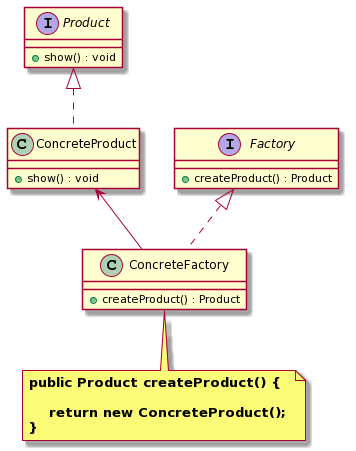

工厂方法模式（`Factory Method Pattern`）
====================
## 意图
>定义了一个创建对象的接口，但由子类决定要实例化的类是哪一个。 

工厂父类定义创建产品对象的公共接口，而工厂子类负责生成具体的产品对象。工厂方法让类把实例化**推迟**到子类，由工厂子类来确定实例化哪一个具体产品类。

## 动机
 在不修改具体工厂类的情况下引进新的产品，如果出现新的产品类型，只需要为这种新的产品创建一个具体的工厂类就可以获得该新产品的实例。这样可以将产品的“实现”从“使用”中解耦，相对于简单工厂模式更加符合“开闭原则”。
 
## 适用性
工厂方法模式通常适用于以下场景：
- 客户只知道创建产品的工厂名，而不知道具体的产品名。如 格力空调工厂、美的空调工厂等。
- 创建对象的任务由多个具体子工厂中的某一个完成，而抽象工厂只提供创建产品的接口。
- 客户不关心创建产品的细节，只关心产品的类型。

## 结构
<div align="center">  </div><br>

## 实现
```java
// 抽象产品
public interface Product {
    void show();
}

// 具体产品A
public class ConcreteProductA implements Product {
    @Override
    public void show() {
        System.out.println("具体产品A。。。");
    }
}
// 抽象工厂
public interface Factory {	
	Product createProduct();
}
// 具体工厂
public class ConcreteFactoryA implements Factory {
	@Override
	public Product createProduct() {
		System.out.println("具体工厂A，new了一个具体产品A");
		return new ConcreteProductA();
	}
}

// 测试客户端
public class TestClient {
    public static void main(String[] args) throws Exception {
        // 具体工厂对象可以注入到Spring中，由Spring容器管理
        Class<?> c = Class.forName("com.dj.pattern.factoryMethod.ConcreteFactoryA");
        FactoryMethod  factory = (FactoryMethod)c.newInstance();
        Product product = factory.createProduct();
        product.show();
    }
}
```
## 应用

- 集合接口 ``Collection`` 中的工厂方法模式

```java
// Collection : 抽象工厂类
public interface Collection<E> extends Iterable<E> {
    // 抽象工厂方法
    Iterator<E> iterator();
    // ...
}

// ArrayList ：具体工厂类，List 接口继承于 Collection
public class ArrayList<E> implements List<E> {
    public Iterator<E> iterator() {
        return new Itr();
    }
}

// 抽象产品类：Iterator
public interface Iterator<E> {
    boolean hasNext();
    E next();
    default void remove() {
        throw new UnsupportedOperationException("remove");
    }
    default void forEachRemaining(Consumer<? super E> action) {
        // ...
    }
}

// 具体产品类：Itr
private class Itr implements Iterator<E> {
    public boolean hasNext() {
        // ...
    }
    public E next() {
        // ...
    }
    public void remove() {
        // ...
    }
    public void forEachRemaining(Consumer<? super E> consumer) {
        // ....
    }
}
```
可在 ``idea`` 按快捷键 ``ctrl+alt+B``， 查看 Collection 的实现类（具体工厂类），Collection 有很多不同类型的集合实现类。

关于抽象工厂方法 iterator() 说明如下：

- Java 的迭代器只在 Collection 中有，而 Map 没有迭代器（有不同的迭代方法）；
- 迭代器用统一的方法对不同的集合进行迭代，而不同集合的迭代逻辑在具体的集合类中实现；
- 迭代器迭代步骤：
    - a> Iterator iterator = Collection.iterator(); 
    - b> iterator.hasNext()、iterator.next() 进行迭代。   

## 总结
简单工厂把全部的产品类，在一个工厂类中处理，而工厂方法是创建了一个框架，让具体的子工厂生产相应的产品，新增产品时，只需要增加具体的工厂，无须对原工厂进行任何修改，比简单工厂更有弹性。但是，每增加一个产品就要增加一个具体产品类和一个对应的具体工厂类，这无疑增加了系统的复杂度。

# 参考资料
- `java.util.Collection#iterator()`
