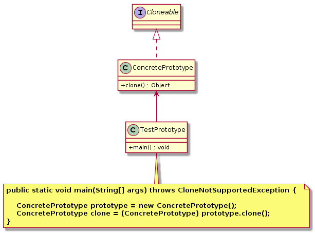

原型模式（`Prototype Pattern`）
====================
## 意图
> 用一个已经创建的实例作为原型，通过复制该原型对象来创建一个和原型相同或相似的新对象。

原型模式的核心是拷贝对象，而根据拷贝对象的内容分为深拷贝和浅拷贝。

## 动机
系统中，存在大量相同或相似对象的创建问题，如果用传统的构造函数来创建对象，会比较复杂且耗时耗资源，用原型模式生成对象就更高效。

## 适用性
原型模式通常适用于以下场景：
- 创建新对象成本较大（如初始化需要占用较长的时间，占用太多的CPU资源或网络资源），新的对象可以通过原型模式对已有对象进行复制来获得；
- 如果系统要保存对象的状态，而对象的状态变化很小，或者对象本身占用内存较少时，可以使用原型模式配合备忘录模式来实现。

## 结构
<div align="center">  </div><br>

## 实现
```
public class ConcretePrototype implements Cloneable {

	public ConcretePrototype() { 
		System.out.println("创建具体原型。。。");
	}

	public Object clone() throws CloneNotSupportedException {
		System.out.println("复制具体原型。。。");
		// 父类 Object.clone() 的浅拷贝
		return (ConcretePrototype) super.clone();
	}

}

public class TestPrototype {

	public static void main(String[] args) throws CloneNotSupportedException {
		ConcretePrototype prototype = new ConcretePrototype();
		ConcretePrototype clone = (ConcretePrototype) prototype.clone();
		System.out.println("原型和拷贝对象引用是否相同：" + (prototype == clone));
	}
}
```
_克隆对象不会调用构造方法，因为执行 clone 方法时是直接从内存中去获取第一次创建对象时初始化的数据。_

## 应用
实现 ``Cloneable`` 接口，调用父类 Object 的 clone() 方法。
```java
// ArrayList 对 clone 的重写
public class ArrayList<E> extends AbstractList<E>
        implements List<E>, RandomAccess, Cloneable, java.io.Serializable {
    public Object clone() {
        try {
            ArrayList<?> v = (ArrayList<?>) super.clone();
            v.elementData = Arrays.copyOf(elementData, size);
            v.modCount = 0;
            return v;
        } catch (CloneNotSupportedException e) {
            // this shouldn't happen, since we are Cloneable
            throw new InternalError(e);
        }
    }
    //...
}
```
- 在 Struts2 中为了保证线程的安全性，Action 对象的创建使用了原型模式，访问一个已经存在的Action 对象时通过克隆的方式创建出一个新的对象，从而保证其中定义的变量无须进行加锁实现同步，每一个 Action 中都有自己的成员变量，避免 Struts1 因使用单例模式而导致的并发和同步问题。

- 在 Spring 中，用户也可采用原型模式来创建新的 bean 实例，从而实现每次获取的是通过克隆生成的新实例，对其进行修改时对原有实例不造成任何影响。

## 总结
原型模式与工厂模式在结构上非常的相似，他们的区别是：工厂模式是通过“创建” 来获得对象，而原型模式则是通过“复制”来获得对象。


