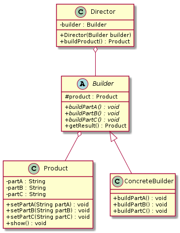
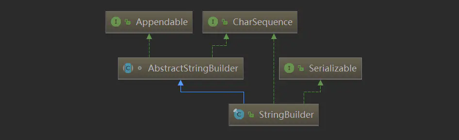

建造者模式（`Builder Pattern`）
====================
## **意图**
> 将一个复杂对象的构建与它的表示分离，使得同样的构建过程可以创建不同的表示。

建造者模式是一步一步创建一个复杂的对象，它允许用户只通过指定复杂对象的类型和内容就可以构建它们，用户不需要知道内部的具体构建细节。(建造者模式又称为生成器模式)

## **动机**
 生活中这样的例子很多，如游戏中的不同角色，其性别、个性、能力、脸型、体型、服装、发型等特性都有所差异；还有汽车中的方向盘、发动机、车架、轮胎等部件也多种多样；每封电子邮件的发件人、收件人、主题、内容、附件等内容也各不相同。

以上所有这些产品都是由多个部件构成的，各个部件可以灵活选择，但其创建步骤都大同小异。这类产品的创建无法用前面介绍的工厂模式描述，而建造者模式可以很好地描述该类产品的创建。

## **适用性**
建造者模式创建的是复杂对象，其产品的各个部分经常面临着剧烈的变化，但将它们组合在一起的算法却相对稳定，所以它通常在以下场合使用。
- 创建的对象较复杂，由多个部件构成，各部件面临着复杂的变化，但构件间的建造顺序是稳定的。
- 创建复杂对象的算法独立于该对象的组成部分以及它们的装配方式，即产品的构建过程和最终的表示是独立的。

## **结构**
<div align="center">  </div><br>

## **实现**

```java
// 产品角色: 由多个部件构成
public class Product {
	private String partA;
	private String partB;
	private String partC;
	public void setPartA(String partA) {
		this.partA = partA;
	}
	public void setPartB(String partB) {
		this.partB = partB;
	}
	public void setPartC(String partC) {
		this.partC = partC;
	}
	public void show() {
		System.out.println("显示产品特性。。。");
	}
}

// 抽象建造者,包含创建产品各个子部件的抽象方法
public abstract class Builder {
	// 创建产品对象
	protected Product product = new Product();
	public abstract void buildPartA();
	public abstract void buildPartB();
	public abstract void buildPartC();
	// 返回产品对象
	public Product getResult() {
		return product;
	}
}

// 具体建造者：实现 Builder 接口，完成复杂产品的各个部件的具体创建方法。
public class ConcreteBuilder extends Builder {
	@Override
	public void buildPartA() {
		// PartA 组装逻辑
		product.setPartA("buildPartA");
	}
	@Override
	public void buildPartB() {
		// PartB 组装逻辑
		product.setPartA("buildPartB");
	}
	@Override
	public void buildPartC() {
		// PartC 组装逻辑
		product.setPartA("buildPartC");
	}
}

// 指挥者：调用建造者中的方法完成复杂对象的创建。
public class Director {
	private Builder builder;
	public Director(Builder builder) {
		this.builder = builder;
	}
    // 产品构建与组装的方法（加工产品的工序相同，但不同的具体建造者加工产品的实现逻辑不同，从而生产出不同的产品）
	public Product buildProduct() {
		builder.buildPartA();
		builder.buildPartB();
		builder.buildPartC();
		return builder.getResult();
	}
}

public class TestClient {
	public static void main(String[] args) {
		Builder builder = new ConcreteBuilder();
		Director director = new Director(builder);
		Product product = director.buildProduct();
		product.show();
	}
}
```
## **应用**
- ``java.lang.StringBuilder`` 中的建造者模式

  ``StringBuilder`` 的继承实现关系如下：
<div align="center">  </div><br>

```
public interface Appendable {
    Appendable append(CharSequence csq) throws IOException;
    Appendable append(CharSequence csq, int start, int end) throws IOException;
    Appendable append(char c) throws IOException;
}

abstract class AbstractStringBuilder implements Appendable, CharSequence {
    char[] value;
    int count;
    
	// 建造顺序是稳定的
    public AbstractStringBuilder append(String str) {
        if (str == null)
            return appendNull();
        int len = str.length();
        ensureCapacityInternal(count + len);
        str.getChars(0, len, value, count);
        count += len;
        return this;
    }
    
    private void ensureCapacityInternal(int minimumCapacity) {
        // overflow-conscious code
        if (minimumCapacity - value.length > 0) {
            value = Arrays.copyOf(value,
                    newCapacity(minimumCapacity));
        }
    }
    // ...
}

public final class StringBuilder extends AbstractStringBuilder implements java.io.Serializable, CharSequence {
    @Override
    public StringBuilder append(String str) {
        super.append(str);
        return this;
    }
    // ...省略...
}
```
可以看出，``Appendable`` 作为抽象建造者，定义了建造方法；``StringBuilder`` 充当具体建造者、指挥者、产品3种角色；建造方法的实现由 ``AbstractStringBuilder.append("")`` 完成，而 ``StringBuilder`` 继承了 ``AbstractStringBuilder``。

## 总结
建造者模式和工厂模式的关注点不同：建造者模式注重构造一个完整复杂产品的步骤，不关心生产细节；而工厂方法模式更注重零部件的创建过程，但两者可以结合使用。

